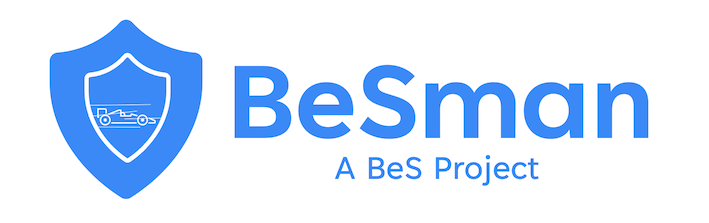

BeSman (pronounced as ‘B-e-S-man’) is a command-line utility designed for creating and provisioning customized security environments. It helps security professionals to reduce the turn around time for assessment of Open Source projects, AI Models, Model Datasets leaving them focus on the assessment task rather than setting up environment for it.

It also provides seamless support for creating and executing BeS playbooks, enabling users to automate complex workflows and tasks. With BeSman, users can efficiently manage and execute playbooks, streamlining their processes and enhancing productivity.

# Key Features

1. Effortless Environment Script Creation: BeSman provides a command-line interface (CLI) for creating environment scripts. Users can easily define the required components, dependencies, configurations, and commands, simplifying the setup process.

2. Rapid Environment Execution: The utility allows users to execute environment scripts with a single command, automating the setup process and saving valuable time. It efficiently installs libraries, frameworks, databases, and other necessary tools, ensuring a fully functional environment.

3. Reusable Environment Scripts: BeSman promotes reusability by allowing users to define and manage reusable environment scripts. Users can create templates or modules that encapsulate common configurations, making it easy to replicate environments across different projects.

4. Customizable Environment Scripts: BeSman supports the use of environment variables, enabling users to define dynamic values that can be easily modified or shared. This flexibility allows for greater adaptability and customization of the environment setup.

5. Playbook Creation: BeSman offers a  command-line interface (CLI) for creating playbooks. Users can define a series of tasks, commands, or actions to be executed in a specific order, automating complex workflows.

6. Rapid Playbook Execution: BeSman allows users to execute playbooks with a single command. It automates the execution of tasks defined in the playbook, saving time and effort.

7. Integration with Environment Scripts: BeSman seamlessly integrates with environment scripts, allowing users to incorporate environment setup and configuration tasks within their playbooks. This ensures a streamlined workflow from environment setup to task execution.

8. Community-Driven Development: BeSman is an open source project that encourages community contributions and collaboration. Users can actively participate in its development, suggest improvements, and report issues, fostering a supportive and innovative ecosystem.  
 

# Key Concepts

- **Environment script**: An environment script is a script file that contains instructions for setting up and configuring the necessary tools, dependencies, and settings required for a specific software or project environment. It typically includes commands or directives to install/manage libraries, frameworks, databases, and other components needed to run the software or project successfully. Environment scripts automate the setup process, ensuring consistency and reproducibility across different environments or systems. They are commonly used in software development, testing, deployment, and other related tasks to streamline the environment setup and configuration
- Each environment script contain the following lifecycle functions,
  - **install**: Installs the required tools.
  - **uninstall**: Removes the installed tools.
  - **validate**: Checks whether all the tools are installed and required configurations are met.
  - **update**: Update configurations of the tools.
  - **reset**: Reset the environment to the default state.
- There are two types of environment script,
  - **RT env** : Stands for Red Team environment script. The env installs all the tools/utilities required for a security analyst to perform vulnerability assessment, create exploits etc.
  - **BT env** : Stand for Blue Team environment script. The env would contain the instruction to install the tools required for a security professional to perform BT activities such as vulnerability remediation and patching.
- The environment scripts are stored and maintained under [besecure-ce-env-repo](https://github.com/Be-Secure/besecure-ce-env-repo).
- **BeS Playbook** : A playbook in Be-Secure ecosystem refers to a set of instructions for completing a routine task. Not to be confused with an Ansible playbook. There can be automated(.sh), interactive(.ipynb) & manual(*.md) playbooks. It helps the security analyst who works in a BeSLab instance to carry out routine tasks in a consistent way. These playbooks are automated and are executed using the BeSman utility.
- Each playbook would contain the following lifecycle functions
  - **init**: Initializes variables and other configuraitons to perform the activity and publish the report.
  - **execute**: Performs the intended activity.
  - **prepare**: Filters data from detailed report to generate OSAR.
  - **publish**: Publishes the detailed report as well as OSAR.
  - **cleanup**: Does clean up of variables and files created during run time.
  - **launch**: Trigger function which calls all the above functions.
- The BeS Playbooks are stored and maintained under [besecure-playbooks-store](https://github.com/Be-Secure/besecure-playbooks-store).

<!-- # Developer Guide

**Welcome, Developers!**

We are thrilled to have you here! Thank you for your interest in contributing to our project. Whether you're a seasoned developer or just getting started, your contributions are highly valued and appreciated. This [guide](developer-guide.md) will help you get up and running and provide you with the necessary information to make your development experience as smooth as possible. -->

# Installation

BeSman is designed to be used in a Linux machine.

`Windows users should use an ubuntu VM or WSL.`

## Skipping tools installation [Optional]

During installation, BeSman will attempt to install several tools (such as `ansible`, `gh`, `jq`, `unzip`, `pip`, `jupyter`, etc.) if they are not already present on your system.  

If you wish to skip the installation of any of these tools, you can set the `BESMAN_SKIP_INSTALLABLES` environment variable with a space-separated list of tool names before running the install command. Then run the installation command.

**Example:**
To skip installing `ansible` and `jq`:

	export BESMAN_SKIP_INSTALLABLES="ansible jq"

## Install latest stable version

1. Open your terminal

2.  Run the below command

        source <(curl -L https://raw.githubusercontent.com/Be-Secure/BeSman/dist/dist/get.besman.io)
	
	**Optional**
	

3.  Run the below command to confirm installation

        bes help

## Install a different version

1. Go to our [release](https://github.com/Be-Secure/BeSman/releases) page and find the version you wish to install.

2. Open your terminal and export the version

		export BESMAN_VERSION=<paste the version here>
        
3. Run the below command to install 
		
		source <(curl -L https://raw.githubusercontent.com/Be-Secure/BeSman/dist/dist/get.besman.io)

4.  Run the below command to confirm installation

        bes help

## Installation from a Branch

This step is useful for developers,

BeSman also allows you to install the cli from a branch. This is used to quickly test your feature developments or bug fixes.

1. Clone the repo.

		git clone https://github.com/<your id>/BeSman

2. Move into BeSman
	
		cd BeSman

3. Change branch
   
		git checkout <branch name>

4. Run the quick_install file

		source quick_install.sh

This would install BeSman from your current branch.

# Usage

Below are the steps to be performed by the user of BeSman to **setup their machine**, **install an environment** and **run a playbook** to generate the assessment reports and [OSAR](https://be-secure.github.io/bes-schema/assessment-report/#open-source-assessment-report-schema-osar).

## 1. Initial Setup

1. Configure git
   
    	$ git config --global user.name "Your username"
		$ git config --global user.email "your.email@example.com"

2. Set BeSman variable with configured git user name for cloning artifact source code repo and assessment datastore repo.

		$ bes set BESMAN_USER_NAMESPACE <github id/gitlab id>

3. Fork the required repositories. Read [here](https://github.com/Be-Secure/besecure-ce-env-repo/tree/develop?tab=readme-ov-file#2-set-your-githubgitlab-id).

## 2. Environment Setup

Read about environments from our [environment repo](https://github.com/Be-Secure/besecure-ce-env-repo).

### 2.1 List

Use the command to get the available environments for installation.
		
	$ bes list -env

If you wish to change the repo, run the below command
	
	$ bes set BESMAN_ENV_REPO <GitHub Org>/<Repo name>
 
If you wish to change the branch, run the below command
	
	$ bes set BESMAN_ENV_REPO_BRANCH <branch>/<tag>

### 2.2 Edit environment configuration(optional)

`IMPORTANT`: If you are using a common environment to assess multiple artifacts,this step is required.

Visit [environment repo](https://github.com/Be-Secure/besecure-ce-env-repo/tree/develop?tab=readme-ov-file#41-edit-environment-configuration) to see how to edit configuration of an environment. 

### 2.3 Install

From the listed environments(from above list command), choose an environment and its version for installation and run the below command

	$ bes install -env <environment name> -V <version>

### 2.3 Reload environment configuration

The `reload` command reloads the current configuration of the environment.

	$ bes reload

This is useful when,

1. A value for a variable has to be changed for the current environment.
2. Reflecting values in a new terminal session.

This command only works when an environment is installed.

## 3. Playbook Setup

Read about playbooks from our [playbook repo](https://github.com/Be-Secure/besecure-playbooks-store).

### 3.1 List

Use the command to get the available playbooks for performing assessments and generate [OSAR](https://be-secure.github.io/bes-schema/assessment-report/#open-source-assessment-report-schema-osar).

	$ bes list -P

If you wish to change the repo, run the below command
	
	$ bes set BESMAN_PLAYBOOK_REPO <GitHub Org>/<Repo name>
 
If you wish to change the branch, run the below command
	
	$ bes set BESMAN_PLAYBOOK_REPO_BRANCH <branch>/<tag>

### 3.2 Pull

Before running(execute) a playbook, you need to pull(fetch) it to your local machine,

	$ bes pull -P <playbook name> -V <version>

### 3.3 Run

To run a playbook to generate [OSAR](https://be-secure.github.io/bes-schema/assessment-report/#open-source-assessment-report-schema-osar) and detailed assessment report,

	$ bes run -P <playbook name> -V <version>

## 4. Attestation of OSAR

The user can run the `attest` command to attest the [OSAR](https://be-secure.github.io/bes-schema/assessment-report/#open-source-assessment-report-schema-osar) generated by the organization/individual/lab to verify the authenticity of report by any another lab/organization/individual interested in the reports generated by the former.

	$ bes attest --file <osar file name> --path <complete path to dir containing osar file>

	eg: bes attest --file fastjson-1.2.24-osar.json --path ~/besecure-assessment-datastore/fastjson/1.2.24/

# Verification of OSAR

The user can use the `verify` command to verify the authenticity of the OSAR generated by a lab/organization/individual.

**Pre-requisites**

1. Install BeSman.
2. Download the OSAR file, public key and `.bundle` files into the same directory.

**Usage**

	$ bes verify --file <osar file name> --path <complete path to the directory containing downloaded files>

	eg: bes verify --file fastjson-1.2.24-osar.json --path ~/besecure-assessment-datastore/fastjson/1.2.24/

## Other commands

To get the complete set of commands run,

	$ bes help

To get more info regarding a command

	$ bes help <command>

You can find more details of the command from the BeSman [webpage](https://be-secure.github.io/Be-Secure/bes-besman-details/)
